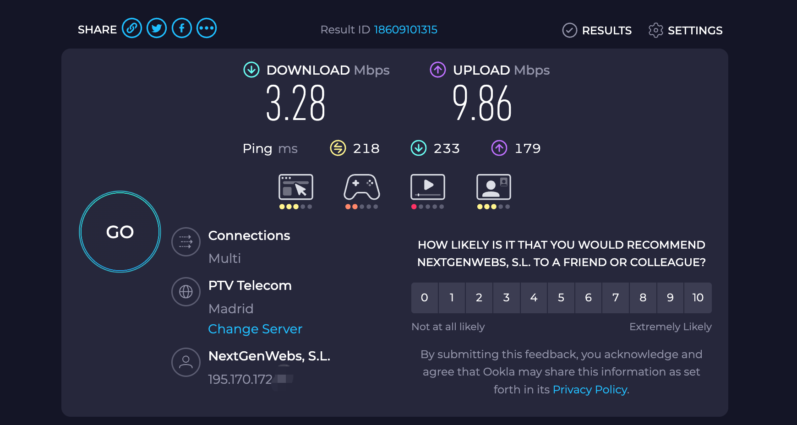
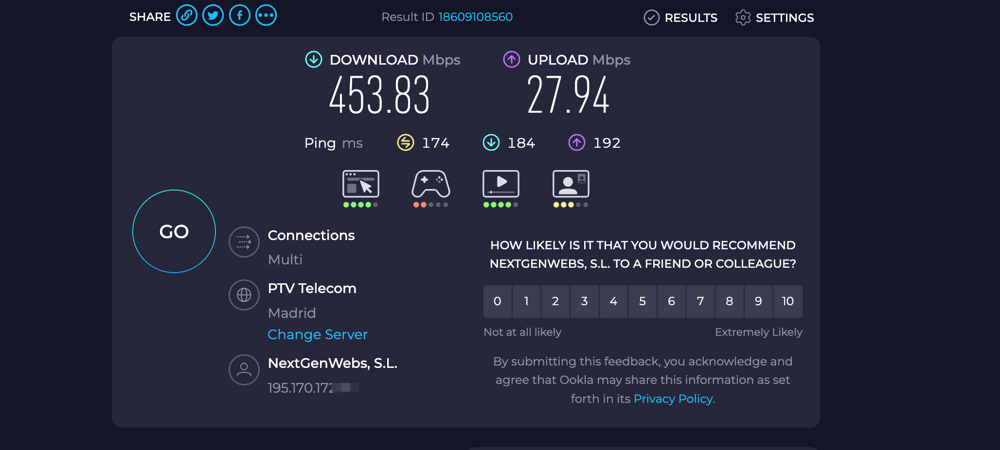

### hyspeed ml-tcp

<div align=center>
    
</div>


### supported kernel

* kernel_version:
    - "6.18.2" # LTS
    - "6.12.8"
    - "6.11.9"
    - "5.15.99"

### project profile

* `main`: hyspeed 基于学习历史记录、RTT 噪声过滤和高延迟补偿进行加速，并且洲际场景抖动不会立即降速避让。


* auto install


```bash
curl -fsSL https://raw.githubusercontent.com/AuroraMaster/hyspeed/main/install.sh | sudo bash
#   or
wget -qO- https://raw.githubusercontent.com/AuroraMaster/hyspeed/main/install.sh | sudo bash
```


* manual compile and load

```bash

# 下载代码/编译

git clone https://github.com/AuroraMaster/hyspeed.git

cd hyspeed && make

# 加载模块
sudo insmod hyspeed.ko

# 设置为当前拥塞控制算法
sudo sysctl -w net.ipv4.tcp_congestion_control=hyspeed
sudo sysctl -w net.ipv4.tcp_no_metrics_save=1

# 查看是否生效
sysctl net.ipv4.tcp_congestion_control

# 查看日志
dmesg -w

```


* helper （hyspeed_beta越小强的越凶，建议大雨620否则会导致CPU飙高）

```bash

[cce ~]$ hyspeed status
╔════════════════════════════════════════════════════════════════════╗
║                   HySpeed v5.6 Status (ML-TCP)                    ║
╟────────────────────────────────────────────────────────────────────╢
║ Module Status                                               Loaded ║
║ Reference Count                                                  1 ║
║ Active Connections                                              00 ║
║ Active Algorithm                                          hyspeed ║
╟────────────────────────────────────────────────────────────────────╢
║                         Current Parameters                         ║
╟────────────────────────────────────────────────────────────────────╢
║ Global Rate Limit                          125.00 MB/s (1.00 Gbps) ║
║ Min CWND                                                16 packets ║
║ Max CWND                                             15000 packets ║
║ Fairness (Beta)                                                60% ║
║ Turbo Mode                                                Disabled ║
║ Safe Mode                                                  Enabled ║
║ FAST Alpha                                              20 packets ║
║ FAST Gamma                                                     50% ║
║ SS Exit Threshold                                              25% ║
║ High-Delay Mode                                            Enabled ║
║ HD Threshold                                              180000us ║
║ HD Reference RTT                                           80000us ║
║ HD Gamma Boost                                                 20% ║
║ HD Alpha Boost                                          10 packets ║
║ Brave Mode                                                 Enabled ║
║ Brave RTT Tolerance                                            25% ║
║ Brave Hold Time                                              400ms ║
║ Brave Floor                                                    85% ║
║ Brave Push                                                      8% ║
╚════════════════════════════════════════════════════════════════════╝
[cce ~]$ hyspeed help
╔════════════════════════════════════════════════════════════════════╗
║                      HySpeed v5.6 Management                      ║
╟────────────────────────────────────────────────────────────────────╢
║ start                                               Start HySpeed ║
║ stop                                                 Stop HySpeed ║
║ restart                                           Restart HySpeed ║
║ status                                                Check Status ║
║ preset [name]                                         Apply Preset ║
║ set [k] [v]                                          Set Parameter ║
║ monitor                                                  Live Logs ║
║ uninstall                                        Remove Completely ║
╟────────────────────────────────────────────────────────────────────╢
║ Presets: conservative, balanced, aggressive                        ║
╚════════════════════════════════════════════════════════════════════╝

```


### test youtube


<div align=center>
    
</div>


### test iperf3 loss

```bash
# disable lro
ethtool -K eth0 lro off
# 丢包16%
sudo tc qdisc add dev ens3 root netem loss 16%
sudo tc qdisc add dev eth0 root netem loss 16%

#取消丢包
sudo tc qdisc del dev ens3 root netem
sudo tc qdisc del dev eth0 root netem

# test command
iperf3 -4 -s -p 35201
iperf3 -c green1 -p 35201 -R -t 30
```


### todo

✅ 基于“时延+丢包”混合驱动的拥塞控制
✅ 学习型状态机
✅ 洲际场景适配


### speedtest 测试结果

* 用之前



* 用之后




PAC (Proactive ACK Control) for TCP Incast Congestion
==========================================

* https://github.com/uk0/TCP-Incast/tree/zeta-tcp


-----------------------------------


## Star History

[](https://www.star-history.com/#AuroraMaster/hyspeed&type=timeline&logscale&legend=top-left)
