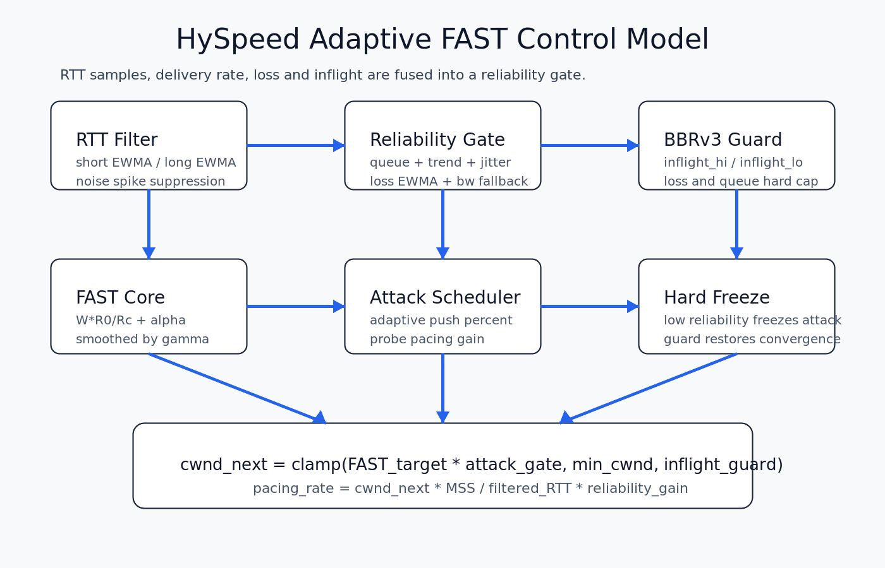

### hyspeed adaptive

当前 `hyspeed` 主线是加入自适应可靠度门控的 FAST delay-based 拥塞控制模块。

主要融合点：

* FAST：用 `base_rtt / filtered_rtt` 控制目标窗口，保持低队列倾向。
* RTT 滤波：短期 EWMA、长期 EWMA 和 RTT 偏差一起区分真实排队与运营商整形/ACK 压缩尖峰。
* BBRv3 思路：维护 `inflight_hi` / `inflight_lo`，在 loss 或持续队列膨胀时给窗口硬上限。
* Polar 码启发：把链路观测分成可靠/不可靠状态；可靠时释放 attack/probe，不可靠时冻结进攻增益。
* 轻量在线优化器：每几个 RTT 用 `bw_gain - queue_cost - loss_cost` 微调 attack/probe，单步有界，不分配内存。



核心公式：

```text
FAST_target = cwnd * base_rtt / filtered_rtt + alpha
reliability = f(queue_growth, rtt_trend, rtt_dev, loss_ewma, bw_fallback)
score       = bw_gain - queue_weight * queue_growth - loss_weight * loss_ewma
cwnd_next   = clamp(FAST_target * attack_gate, min_cwnd, inflight_guard)
pacing_rate = cwnd_next * MSS / filtered_rtt * reliability_gain
```

测试时重点看三类指标，而不是只看单次测速峰值：

```text
1. 吞吐：iperf3 平均值、反向测试、并发连接
2. 收敛：RTT 抖动后 cwnd/pacing 是否快速恢复
3. 代价：retrans、p95 RTT、公平性 Jain index
4. 优化器：调高 attack/probe 后是否能在 loss/queue 上升时自动降回
```

推荐测试矩阵：

```bash
iperf3 -c SERVER_IP -p 35201 -t 60
iperf3 -c SERVER_IP -p 35201 -R -t 60
iperf3 -c SERVER_IP -p 35201 -P 4 -t 60
sudo tc qdisc add dev eth0 root netem delay 120ms 20ms loss 0.5%
iperf3 -c SERVER_IP -p 35201 -t 60
sudo tc qdisc del dev eth0 root
```
